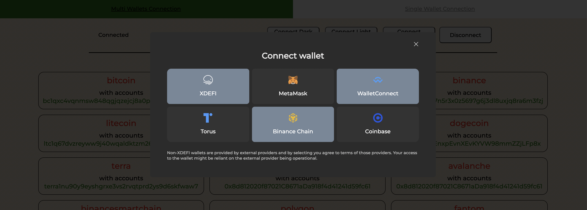
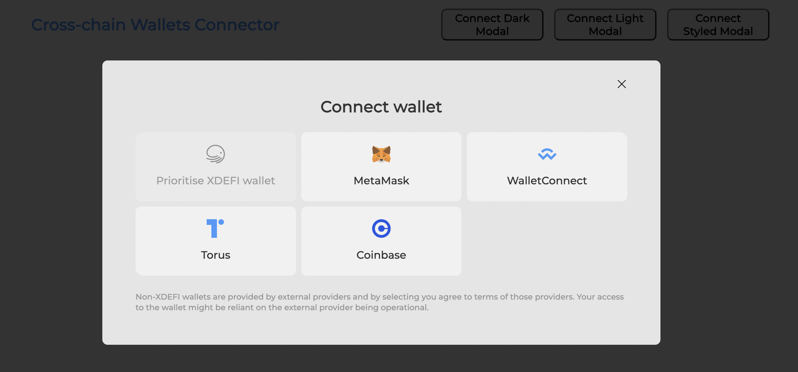

# @xdefi/wallets-connector

- [@xdefi/wallets-connector](#xdefiwallets-connector)
  - [Install](#install)
  - [Introduction](#introduction)
  - [Usage/Custom Providers Display](#usagecustom-providers-display)
  - [Using with ethers.js](#using-with-ethersjs)
  - [Using with Vite](#using-with-vite)
  - [Using in vanilla JavaScript](#using-in-vanilla-javascript)
  - [Provider Events](#provider-events)
- [Internal events (`src/constants/events` and usage at `src/hooks/events` )](#internal-events-srcconstantsevents-and-usage-at-srchooksevents-)
  - [React example of usage with custom hooks (but we recommend to use this Hooks)](#react-example-of-usage-with-custom-hooks-but-we-recommend-to-use-this-hooks)
- [Hooks](#hooks)
  - [Hooks for multi/single connections (library allows to connect more then 1 provider per session)](#hooks-for-multisingle-connections-library-allows-to-connect-more-then-1-provider-per-session)
  - [Hooks for multichain methods](#hooks-for-multichain-methods)
  - [Custom Theme](#custom-theme)
  - [Provider Options](#provider-options)
  - [Adding a new provider](#adding-a-new-provider) - [Add new injected provider](#add-new-injected-provider)
- [Contributions](#contributions)
  - [License](#license)

Example: https://xdefi-tech.github.io/walletconnect/

Please, look at the example application in folder `example`




## Install

```bash
yarn add @xdefi/wallets-connector
```

## Introduction

@xdefi/wallets-connector is an easy-to-use library to help developers add support for multiple providers in their apps with a simple customizable configuration.

By default Library supports injected providers like ( **Metamask**,**Brave Wallet**, **Dapper**, **Frame**, **Gnosis Safe**, **Tally**, Web3 Browsers, etc) and **WalletConnect**. You can also easily configure the library to support **Coinbase Wallet**, **Torus**, **Portis**, **Fortmatic** and many more.

## Usage/Custom Providers Display

It's possible to customize the display of each provider to change the name, description and logo. These options are available as part of the provider options as following

```tsx
const getProviderOptions = (): IProviderOptions => {
  const infuraId = 'your_infura_key'
  const providerOptions = {
    xdefi: {
      package: true,
      connector: connectors.injected,
      display: injected.XDEFI
    },
    injected: {
      package: true,
      connector: connectors.injected,
      display: injected.FALLBACK
    },
    metamask: {
      package: true,
      connector: connectors.injected,
      display: injected.METAMASK
    },
    walletconnect: {
      package: WalletConnect,
      options: {
        infuraId
      }
    },
    coinbasewallet: {
      package: CoinbaseWalletSDK,
      options: {
        appName: 'Coinbase App',
        infuraId
      }
    },
    torus: {
      package: Torus
    }
  }
  return providerOptions
}

function App() {
  const [options] = useState(() => getProviderOptions())
  return (
    <NetworkManager options={options}>
      <MyApp />
    </NetworkManager>
  )
}
```

## Using with [ethers.js](https://github.com/ethers-io/ethers.js/)

```js
import { ethers } from "ethers";

...

const { provider } = useConnectorSingleProvider();

const walletRequest = useWalletRequest();

const signTransaction = useCallback(
  async (transaction: RouteTransactionType) => {
    const { chain, unsignedStdTx } = transaction;
    const unSignedTx =
      typeof unsignedStdTx === 'string'
        ? JSON.parse(unsignedStdTx)
        : unsignedStdTx;

    if (
      [
        IChainType.bitcoin,
        IChainType.litecoin,
        IChainType.bitcoincash,
        IChainType.dogecoin,
      ].includes(mapChainNameToIChain[chain])
    ) {
      const result = await walletRequest({
        chainId: mapChainNameToIChain[chain],
        method: 'transfer',
        params: [
          YOUR_TX_PARAMS,
        ],
      });

      return result;
    } else if (mapChainNameToIChain[chain] === IChainType.thorchain) {
      // const asset = assetFromDenom(
      //   unSignedTx.msg[0].value.coins[0].asset || ''
      // );
      const { asset } = unSignedTx.msg[0].value.coins[0];
      const payloadAsset = {
        chain: transaction.chain,
        symbol: asset.includes('.') ? asset.split('.')[1] : asset,
        ticker: asset.includes('.') ? asset.split('.')[1] : asset,
      };
      const result = await walletRequest({
        chainId: mapChainNameToIChain[chain],
        method: 'deposit',
        params: [
          YOUR_TX_PARAMS,
        ],
      });
      return result;
    } else if (mapChainNameToIChain[chain] === IChainType.binance) {
      const result = await walletRequest({
        chainId: mapChainNameToIChain[chain],
        method: 'transfer',
        params: [
          YOUR_TX_PARAMS,
        ],
      });
      return result;
    } else {
      throw new Error(`${chain} is not yet supported 🥺`);
    }
  },
  [walletRequest]
);

const web3Provider = useMemo(() => {
  if (provider) {
    const web3 = new ethers.providers.Web3Provider(provider);
    return web3;
  }
  return null;
}, [provider]);

const etherSigner = useMemo(() => {
  if (!web3Provider) return null;
  return web3Provider.getSigner();
}, [web3Provider]);

```

## Using with [Vite](https://github.com/vitejs/vite)

```js
//vite.config.js
import nodePolyfills from 'rollup-plugin-polyfill-node'
const production = process.env.NODE_ENV === 'production'

export default {
  plugins: [
    // ↓ Needed for development mode
    !production &&
      nodePolyfills({
        include: ['node_modules/**/*.js', new RegExp('node_modules/.vite/.*js')]
      })
  ],

  build: {
    rollupOptions: {
      plugins: [
        // ↓ Needed for build
        nodePolyfills()
      ]
    },
    // ↓ Needed for build if using WalletConnect and other providers
    commonjsOptions: {
      transformMixedEsModules: true
    }
  }
}
```

## Using in vanilla JavaScript

You can use the modal from the old fashioned web page JavaScript as well.

First get a library bundled JavaScript from Releases.

After including the bundle in your HTML, you can use it on your web page:

// You have to refer to default since it was bundled for ESModules
// but after that the documentation will be the same

```
const providerOptions = {
  /* See Provider Options Section */
};

const connector = new WalletsConnector(
        options, // from getProviderOptions
        network, // 'mainnet'
        cacheEnabled, // true
        isSingleProviderEnabled // true
      );

await connector.connect();

connector.on(WALLETS_EVENTS.ACCOUNTS, (newList: IProviderWithAccounts) => {
  doSmthWithAccounts(newList)
})
```

## Provider Events

You can subscribe to provider events compatible with [EIP-1193](https://eips.ethereum.org/EIPS/eip-1193) standard.

```typescript
// Subscribe to accounts change
provider.on('accountsChanged', (accounts: string[]) => {
  console.log(accounts)
})

// Subscribe to chainId change
provider.on('chainChanged', (chainId: number) => {
  console.log(chainId)
})

// Subscribe to provider connection
provider.on('connect', (info: { chainId: number }) => {
  console.log(info)
})

// Subscribe to provider disconnection
provider.on('disconnect', (error: { code: number; message: string }) => {
  console.log(error)
})
```

# Internal events (`src/constants/events` and usage at `src/hooks/events` )

### React example of usage with custom hooks (but we recommend to use this [Hooks](#hooks))

```tsx
const context = useContext(WalletsContext)

const [current, setCurrentProvider] = useState<IProviderInfo>()
const [accounts, setAccounts] = useState<IProviderWithAccounts>({})

useEffect(() => {
  if (context) {
    context.on(WALLETS_EVENTS.ACCOUNTS, (newList: IProviderWithAccounts) => {
      setAccounts(newList)
    })
  }
}, [context])
```

# Hooks

## Hooks for multi/single connections (library allows to connect more then 1 provider per session)

| Hooks                      | Description                                                                         |
| -------------------------- | ----------------------------------------------------------------------------------- |
| useConnectorActiveIds      | Return list of connected providers (Metamask, XDeFi, WalletConnect, etc)            |
| useConnectorMultiConfigs   | Return configs per provider (chain, network, address - just for web3/EVM providers) |
| useConnectorSingleConfigs  | Same, just for one connected provider (for single connection mode)                  |
| useConnectorMultiProviders | Return list of providers for using with `Web3` or `Ether.js` library                |
| useConnectorSingleProvider | Same, just for one connected provider (for single connection mode)                  |
| useConnectorMultiChains    | Return list of connected chains per provider                                        |
| useConnectorSingleChains   | Same, just for one connected provider (for single connection mode)                  |
| useConnectedMultiAccounts  | Return list of connected accounts with providers                                    |
| useConnectedSingleAccounts | Same, just for one connected provider (for single connection mode)                  |
| useWalletEvents            | Hook tracks connection/error/disconnection events                                   |
| useWalletsOptions          | Returns list of providers (provided by user application) and method to disconnect   |

## Hooks for multichain methods

| Hooks                  | Description                                                                                                                                                                                                                               |
| ---------------------- | ----------------------------------------------------------------------------------------------------------------------------------------------------------------------------------------------------------------------------------------- |
| useWalletRequest       | Allows to send custom txs/request into connected wallet                                                                                                                                                                                   |
| useRequestAvailability | Just for multichain providers. Check availability for request/method in wallet (check [Adding a new provider](#adding-a-new-provider) field 'methods' with different request. For example XDEFI has `getAccounts` and `request` methods ) |

```tsx
const accounts = useConnectedAccounts()

const isConnected = useStore((state) => state.connected)
const setIsConnected = useStore((state) => state.setConnected)

const onConnectHandler = useCallback(() => {
  setIsConnected(true)
}, [setIsConnected])
const onErrorHandler = useCallback(() => {
  setIsConnected(false)
}, [setIsConnected])
const onCloseHandler = useCallback(() => {
  setIsConnected(false)
}, [setIsConnected])

useWalletEvents(onConnectHandler, onCloseHandler, onErrorHandler)
```

## Custom Theme

```tsx

const CUSTOM_THEME_BUILDER = (darkMode: boolean): any => ({
  white: darkMode ? '#0969da' : '#9a6700',
  black: darkMode ? '#9a6700' : '#0969da',
  modal: {
    bg: darkMode ? '#2b2b2b' : '#E5E5E5',
    layoutBg: darkMode ? '#000000' : '#000000'
  },
  wallet: {
    name: darkMode ? '#9a6700' : '#333333',
    descColor: darkMode ? '#c4c4c4' : '#979797',
    titleColor: darkMode ? '#f2f1f1' : '#333333',
    bg: darkMode ? '#333333' : '#F2F1F1',
    activeBg: darkMode ? 'lightslategrey' : 'darkseagreen'
  }
})

...

<WalletsModal
  themeBuilder={CUSTOM_THEME_BUILDER}
  isDark={true} // true/false
  isSingleProviderEnabled={false} // true/false
  trigger={(props: any) => (
    <BtnOpen {...props}>Connect Styled Modal</BtnOpen>
  )}
/>
```

## Provider Options

These are all the providers available with library and how to configure their provider options:

- [WalletConnect](./docs/providers/walletconnect.md)
- [Coinbase Wallet](./docs/providers/coinbasewallet.md)
- [Fortmatic](./docs/providers/fortmatic.md)
- [Torus](./docs/providers/torus.md)
- [Portis](./docs/providers/portis.md)
- [Authereum](./docs/providers/authereum.md)
- [Frame](./docs/providers/frame.md)
- [Bitski](./docs/providers/bitski.md)
- [Venly](./docs/providers/venly.md)
- [DCent](./docs/providers/dcent.md)
- [BurnerConnect](./docs/providers/burnerconnect.md)
- [MEWConnect](./docs/providers/mewconnect.md)
- [Binance Chain Wallet](./docs/providers/binancechainwallet.md)
  [Opera Wallet](./docs/providers/opera.md)
- [Sequence](./docs/providers/sequence.md)
- [CLV Wallet](./docs/providers/clvwallet.md)
- [Web3Auth](./docs/providers/web3auth.md)
- [Bitkeep Wallet](./docs/providers/bitkeep.md)
- [99Starz Wallet](./docs/providers/starzwallet.md)

## Adding a new provider

Do you want to add your provider to Web3Modal? All logic for supported providers lives inside the `src/providers` directory. To add a new follow the following steps [here](docs/ADDING_PROVIDERS.md)

##### Add new injected provider

Custom browser extension example inside the `src/providers/injected` file

```ts
export const XDEFI: IProviderInfo = {
  id: WALLETS.xdefi,
  name: 'XDEFI',
  logo: XDEFILogo,
  type: 'injected',
  check: '__XDEFI',
  installationLink: 'https://xdefi.io',
  getEthereumProvider: () => {
    return window.xfi ? window.xfi.ethereum : undefined
  },
  needPrioritiseFunc: () => {
    /* if (window.xfi && window.xfi.info) {
      const {
        lastConfigChanges: { ethereumProvider }
      } = window.xfi.info
      const { inject, pretendMetamask } = ethereumProvider
      return inject && !pretendMetamask
    }
    */
    return false
  },
  supportedEvmChains: [
    IChainType.avalanche,
    IChainType.binancesmartchain,
    IChainType.polygon,
    IChainType.fantom,
    IChainType.arbitrum
  ],
  chains: {
    [IChainType.bitcoin]: {
      methods: {
        getAccounts: () => {
          return new Promise((resolve, reject) => {
            window.xfi.bitcoin.request(
              { method: 'request_accounts', params: [] },
              (error: any, accounts: any) => {
                if (error) {
                  reject(error)
                }

                resolve(accounts)
              }
            )
          })
        },
        signTransaction: (hash: string) => {
          return new Promise((resolve, reject) => {
            window.xfi.bitcoin.request(
              { method: 'sign_transaction', params: [hash] },
              (error: any, result: any) => {
                if (error) {
                  reject(error)
                }

                resolve(result)
              }
            )
          })
        },
        request: (method: string, data: any) => {
          return new Promise((resolve, reject) => {
            window.xfi.bitcoin.request(
              { method: method, params: data },
              (error: any, result: any) => {
                if (error) {
                  reject(error)
                }

                resolve(result)
              }
            )
          })
        }
      }
    },
    [IChainType.thorchain]: {
      methods: {
        getAccounts: () => {
          return new Promise((resolve, reject) => {
            window.xfi.thorchain.request(
              { method: 'request_accounts', params: [] },
              (error: any, accounts: any) => {
                if (error) {
                  reject(error)
                }

                resolve(accounts)
              }
            )
          })
        },
        request: (method: string, data: any) => {
          return new Promise((resolve, reject) => {
            window.xfi.thorchain.request(
              { method: method, params: data },
              (error: any, result: any) => {
                if (error) {
                  reject(error)
                }

                resolve(result)
              }
            )
          })
        }
      }
    },
    [IChainType.binance]: {
      methods: {
        getAccounts: () => {
          return new Promise((resolve, reject) => {
            window.xfi.binance.request(
              { method: 'request_accounts', params: [] },
              (error: any, accounts: any) => {
                if (error) {
                  reject(error)
                }

                resolve(accounts)
              }
            )
          })
        },
        signTransaction: (hash: string) => {
          return new Promise((resolve, reject) => {
            window.xfi.binance.request(
              { method: 'sign_transaction', params: [hash] },
              (error: any, result: any) => {
                if (error) {
                  reject(error)
                }

                resolve(result)
              }
            )
          })
        },
        request: (method: string, data: any) => {
          return new Promise((resolve, reject) => {
            window.xfi.binance.request(
              { method: method, params: data },
              (error: any, result: any) => {
                if (error) {
                  reject(error)
                }

                resolve(result)
              }
            )
          })
        }
      }
    },
    [IChainType.litecoin]: {
      methods: {
        getAccounts: () => {
          return new Promise((resolve, reject) => {
            window.xfi.litecoin.request(
              { method: 'request_accounts', params: [] },
              (error: any, accounts: any) => {
                if (error) {
                  reject(error)
                }

                resolve(accounts)
              }
            )
          })
        },
        request: (method: string, data: any) => {
          return new Promise((resolve, reject) => {
            window.xfi.litecoin.request(
              { method: method, params: data },
              (error: any, result: any) => {
                if (error) {
                  reject(error)
                }

                resolve(result)
              }
            )
          })
        }
      }
    },
    [IChainType.bitcoincash]: {
      methods: {
        getAccounts: () => {
          return new Promise((resolve, reject) => {
            window.xfi.bitcoincash.request(
              { method: 'request_accounts', params: [] },
              (error: any, accounts: any) => {
                if (error) {
                  reject(error)
                }

                resolve(accounts)
              }
            )
          })
        },
        request: (method: string, data: any) => {
          return new Promise((resolve, reject) => {
            window.xfi.bitcoincash.request(
              { method: method, params: data },
              (error: any, result: any) => {
                if (error) {
                  reject(error)
                }

                resolve(result)
              }
            )
          })
        }
      }
    },
    [IChainType.dogecoin]: {
      methods: {
        getAccounts: () => {
          return new Promise((resolve, reject) => {
            if (!window.xfi.dogecoin) {
              resolve([])
              return
            }

            window.xfi.dogecoin.request(
              { method: 'request_accounts', params: [] },
              (error: any, accounts: any) => {
                if (error) {
                  reject(error)
                }

                resolve(accounts)
              }
            )
          })
        },
        request: (method: string, data: any) => {
          return new Promise((resolve, reject) => {
            window.xfi.dogecoin.request(
              { method: method, params: data },
              (error: any, result: any) => {
                if (error) {
                  reject(error)
                }

                resolve(result)
              }
            )
          })
        }
      }
    },
    [IChainType.ethereum]: {
      methods: {
        getAccounts: () => {
          return new Promise((resolve, reject) => {
            if (!window.xfi.ethereum) {
              resolve([])
              return
            }

            window.xfi.ethereum.request(
              { method: 'request_accounts', params: [] },
              (error: any, accounts: any) => {
                if (error) {
                  reject(error)
                }

                resolve(accounts)
              }
            )
          })
        },
        request: (method: string, data: any) => {
          return new Promise((resolve, reject) => {
            window.xfi.ethereum.request(
              { method: method, params: data },
              (error: any, result: any) => {
                if (error) {
                  reject(error)
                }

                resolve(result)
              }
            )
          })
        }
      }
    },
    [IChainType.terra]: {
      methods: {
        getAccounts: () => {
          return new Promise((resolve, reject) => {
            if (!window.terraWallets) {
              reject('No terra connector')
            }

            const terraWalletXdefi = window.terraWallets.find(
              (w) => w.identifier === 'xdefi-wallet'
            )

            if (!terraWalletXdefi) {
              reject('No terra connector')
            }

            const connector = terraWalletXdefi.connector()

            const { states: stream } = connector

            stream.subscribe(
              (x: any) => {
                if (x.wallets) {
                  resolve(x.wallets.map((w: any) => w.terraAddress))
                }
              },
              (err: any) => {
                console.error('something wrong occurred: ' + err)
              }
            )

            connector.refetchStates()
          })
        },
        request: (method: string, data: any) => {
          return new Promise((resolve, reject) => {
            const terraWalletXdefi = window.terraWallets.find(
              (w) => w.identifier === 'xdefi-wallet'
            )

            if (!terraWalletXdefi) {
              reject('No terra connector')
            }

            const connector = terraWalletXdefi.connector()
            const subscriber = connector[method](...data)

            subscriber.subscribe((r: any) => {
              if (r.payload) {
                resolve(r.payload)
              }
            })
          })
        }
      }
    }
  }
}
```

# Contributions

**Code contributions are welcome ❤️❤️❤️!**

If you wish to support a new provider submit a issue to the repo or fork this repo and create a pull request.

## License

MIT
