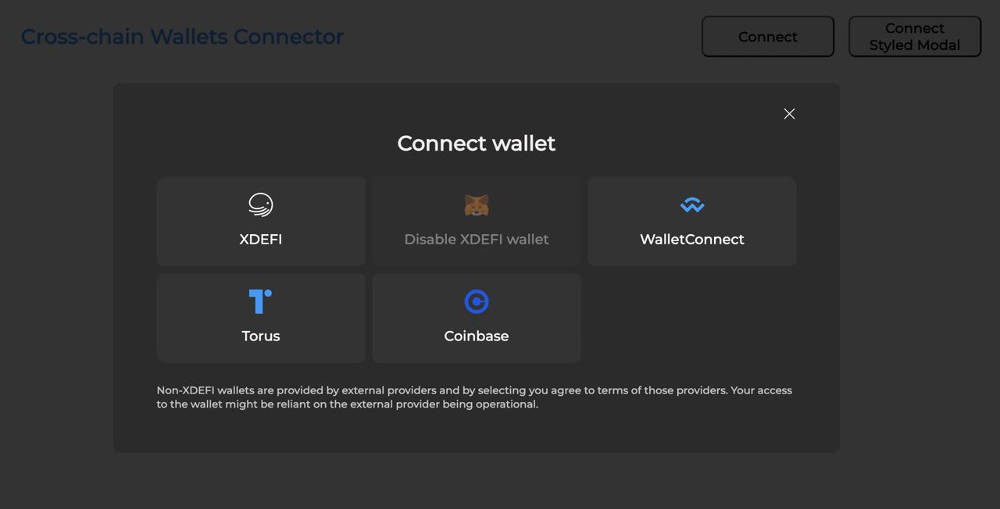

# @xdefi/wallets-connector

Example: https://xdefi-tech.github.io/walletconnect/




Please, look at the example application in folder `example`

## Install

```bash
yarn add @xdefi/wallets-connector
```

## Usage

```tsx
const getProviderOptions = (): IProviderOptions => {
  const infuraId = 'your_infura_key'
  const providerOptions = {
    xdefi: {
      package: true,
      connector: connectors.injected,
      display: injected.XDEFI
    },
    injected: {
      package: true,
      connector: connectors.injected,
      display: injected.FALLBACK
    },
    metamask: {
      package: true,
      connector: connectors.injected,
      display: injected.METAMASK
    },
    walletconnect: {
      package: WalletConnect,
      options: {
        infuraId
      }
    },
    coinbasewallet: {
      package: CoinbaseWalletSDK,
      options: {
        appName: 'Coinbase App',
        infuraId
      }
    },
    torus: {
      package: Torus
    }
  }
  return providerOptions
}

function App() {
  const [options] = useState(() => getProviderOptions())
  return (
    <NetworkManager options={options}>
      <MyApp />
    </NetworkManager>
  )
}
```

# Internal events

```tsx
const context = useContext(WalletsContext)

const [current, setCurrentProvider] = useState<IProviderInfo>()
const [accounts, setAccounts] = useState<IChainWithAccount>({})

useEffect(() => {
  if (context) {
    context.on(WALLETS_EVENTS.CURRENT_WALLET, (provider: IProviderInfo) => {
      setCurrentProvider(provider)
    })

    context.on(WALLETS_EVENTS.ACCOUNTS, (newList: IChainWithAccount) => {
      setAccounts(newList)
    })
  }
}, [context])
```

# Hooks

```tsx
const accounts = useConnectedAccounts()

const isConnected = useStore((state) => state.connected)
const setIsConnected = useStore((state) => state.setConnected)

const onConnectHandler = useCallback(() => {
  setIsConnected(true)
}, [setIsConnected])
const onErrorHandler = useCallback(() => {
  setIsConnected(false)
}, [setIsConnected])
const onCloseHandler = useCallback(() => {
  setIsConnected(false)
}, [setIsConnected])

useWalletEvents(onConnectHandler, onCloseHandler, onErrorHandler)
```

# Custom Theme

```tsx

const CUSTOM_THEME_BUILDER = (darkMode: boolean): any => ({
  white: darkMode ? '#0969da' : '#9a6700',
  black: darkMode ? '#9a6700' : '#0969da',
  modal: {
    bg: darkMode ? '#2b2b2b' : '#E5E5E5',
    layoutBg: darkMode ? '#000000' : '#000000'
  },
  wallet: {
    name: darkMode ? '#9a6700' : '#333333',
    descColor: darkMode ? '#c4c4c4' : '#979797',
    titleColor: darkMode ? '#f2f1f1' : '#333333',
    bg: darkMode ? '#333333' : '#F2F1F1',
    activeBg: darkMode ? 'lightslategrey' : 'darkseagreen'
  }
})

...

<WalletsModal
  themeBuilder={CUSTOM_THEME_BUILDER}
  isDark={true} // true/false
  trigger={(props: any) => (
    <BtnOpen {...props}>Connect Styled Modal</BtnOpen>
  )}
/>
```
